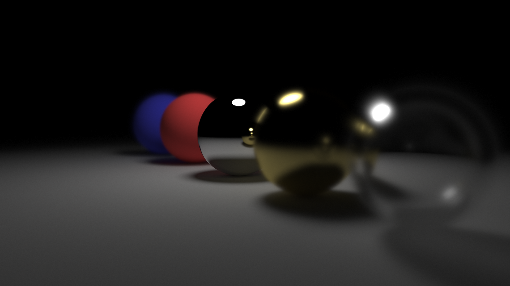
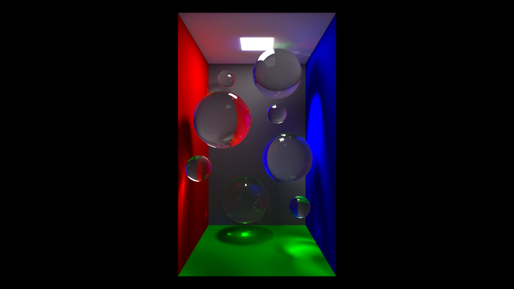
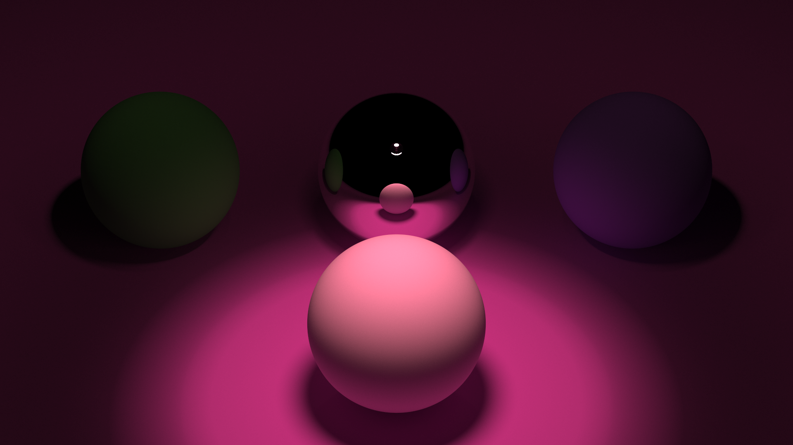

# "Real Time" Raytracer
This raytracers uses a shader to run on the gpu instead of the cpu

## Features
- Difuse materials
- Dielectric materials
- Mirrors
- Light source
- Sphere intersection
- Triangle intersection (no mesh/model support yet, and also no BVH)

## Renders

## Keybinds
- WASD to move
- Mouse to look around
- Espace/C to go up and down
- Scrollwheel to change vertical FOV
- Arrow up/down to change defocus angle by 1
- Arrow left/right to change focus distance by 1

## Compile
Just run the makefile
